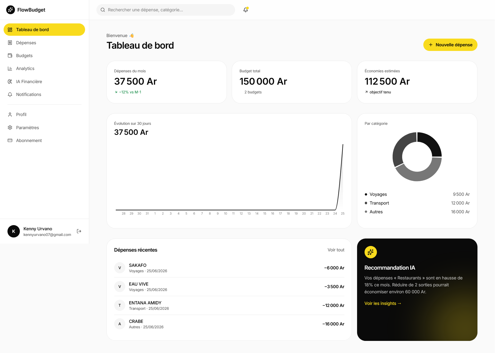

# FlowBudget AI

FlowBudget AI est une plateforme SaaS moderne de gestion intelligente des dépenses personnelles.

L’application permet de suivre ses finances, gérer ses budgets, analyser ses dépenses et recevoir des recommandations financières intelligentes via une interface fintech premium.

## Aperçu

## Fonctionnalités

- Gestion des dépenses
- Suivi des budgets
- Analytics financiers
- Dashboard interactif
- Insights IA
- Authentification sécurisée
- Responsive mobile
- Notifications et abonnements

## Stack Technique

### Frontend
- React
- TanStack Start
- Tailwind CSS v4
- Framer Motion
- Recharts

### Backend
- Server Functions TanStack
- PostgreSQL
- JWT Authentication
- Row Level Security (RLS)

## Design System

- UI fintech premium
- Blanc / noir / CTA jaune `#FFD600`
- Glassmorphism subtil
- Animations fluides
- Mobile-first
